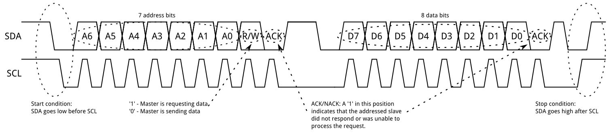

# Physical Protocol

Communication across the bus begins when the leader sends out a **start sequence**, which followed by an **address frame**. Once acknowledged, then comes one ore more 8-bit **data frames** \(which are each followed by an **acknowledgement bit**\). Finally the communication concludes with the leader sending a **stop sequence**.

## Start Sequence

The start sequence happens when the leader is ready to send or request data on the bus. To do this, the master pulls SDA \(data line\) low while SCL \(clock line\) remains high. The start and stop sequence are the only times when SDA changes while SCL is high.

## Address Frame

Leaders must know the addresses of followers in order to communicate with them. The address frame follows immediately after the start sequence, and contains 9 bits: the first seven bits are used for the follower's **7-bit address** with the [**most significant bit**](../most-and-least-significant-bit.md) \(MSB\) first, and the eighth bit is the **read/write bit** and is is used to indicate whether the leader will **read** \(`1`\) or **write** \(`0`\). The ninth and final bit of the address frame is the **ACK/NACK bit** \(acknowledge/negative acknowledge\). 

This ACK/NACK happens on the ninth clock pulse when control over SDA \(data line\) is given to the receiver, in this case, the follower with the address transmitted in the address frame. To acknowledge that the follower is ready, it pulls SDA \(data line\) low. If on the ninth clock pulse SDA \(data line\) is still high, it is assumed that the receiving device either did not receive the data or did not know how to parse the message. In this case, it is up to the leader to recover.

## Data Frame

After the start sequence, address frame, and acknowledgement, **data frames** can begin to be transmitted over SDA \(data line\), again with the [most significant bit](../most-and-least-significant-bit.md) first. The leader will continue control over the SCL \(clock line\), and either the leader or follower will transmit 8 bits of data on SDA depending on the read/write bit in the address frame. The number of frames is dictated by the size of the message being transmitted.

After each 8-bit frame, a ninth bit, again, represents an ACK/NACK. This is controlled by the receiver, which can either be the follower, when in write mode, or the leader, when in read mode.

## Stop Sequence

After all of the data frames are transmitted, the leader will generate a stop sequence by **allowing SDA \(data line\) to go high** _**while**_ **SCL \(clock line\) is high**. During data transmission, SDA \(data line\) does not change while SCL \(clock line\) is high.

