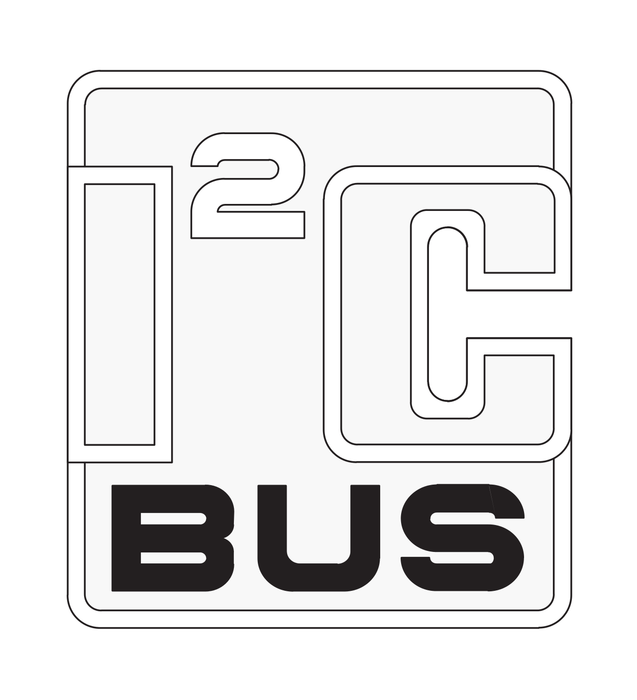

# I²C Protocol

I2C \(or I²C\) is a communication protocol for integrated circuits, namely microprocessors. It's an alternative to SPI \(Serial Peripheral Interface\) and UART \(Universal Asynchronous Receiver Transmitter\) protocols.

The core benefit of I2C is that is allows for many "follower" components to bidirectionally communication to a main "leader" component with only 2 logic wires, VCC, and ground. A leader initiates communication to a specific follower by sending out the follower's address. If the follower hear's its address, it acknowledges that it is ready to send or receive data.

