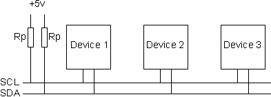

# Physical Bus

The two logic wires are **SCL**, serial clock line used to synchronize the devices communicated with each other, and **SDA**, serial data line. These two lines are connected to all of the devices on the I2C bus. Both SCL and SDA are **open drain** drivers, which means that devices communicating on the bus can drive the lines to logic low through a common ground line. Therefore, the two data lines must be pulled to a logic high by using pull-up resistors.

