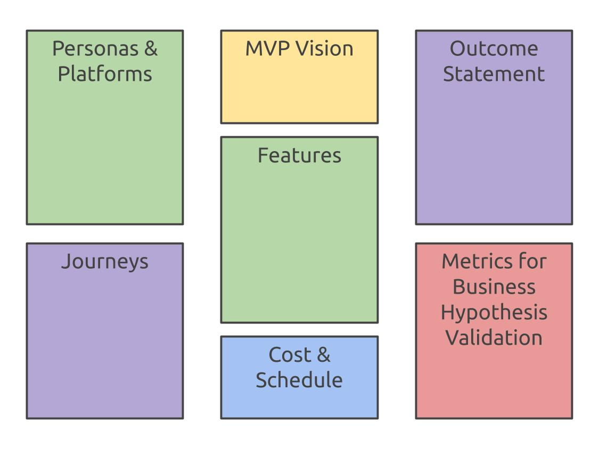

# Build the MVP Canvas

The MVP canvas is the final artifact of the inception process. We build a canvas for each iteration discovered in the Sequence of Features exercise.

In building an MVP, we should focus on users and their journeys, being sure to work on the actions that improve or simplify their lives. 

However, we also must explore the business case by developing a hypothesis that can be tested with the MVP. This helps us understand if we’re taking steps in the right direction.

### Populating the Canvas:

* **MVP Vision**: In the beginning, we agreed upon an overall product vision, but here, we want to state a vision for this MVP iteration. What are we trying to learn?
* **Outcome Statement**: What do we believe this MVP iteration will achieve? What do we expect to learn?
* **Metrics for Business Hypothesis Validation**: How do we know when to pivot and when to persevere? What would determine the success or failure? What data should we collect?
* **Personas & Platform**: We identified personas for the who product, but here, we want to identify a smaller set of personas relevant to this iteration. An MVP iteration should also only target one or two of the platforms for the overall product. e.g. We focus on the web client before taking a look at the mobile app.
* **Journeys**: For this iteration, which journeys will be improved by this MVP?
* **Features**: We figured out the features for this MVP, so we’ll copy them here. Is it complete? After reviewing the canvas up unto this point, we can add any missing features here.
* **Cost & Schedule**: By looking at the features we have for this MVP iteration, what is the cost and schedule?



