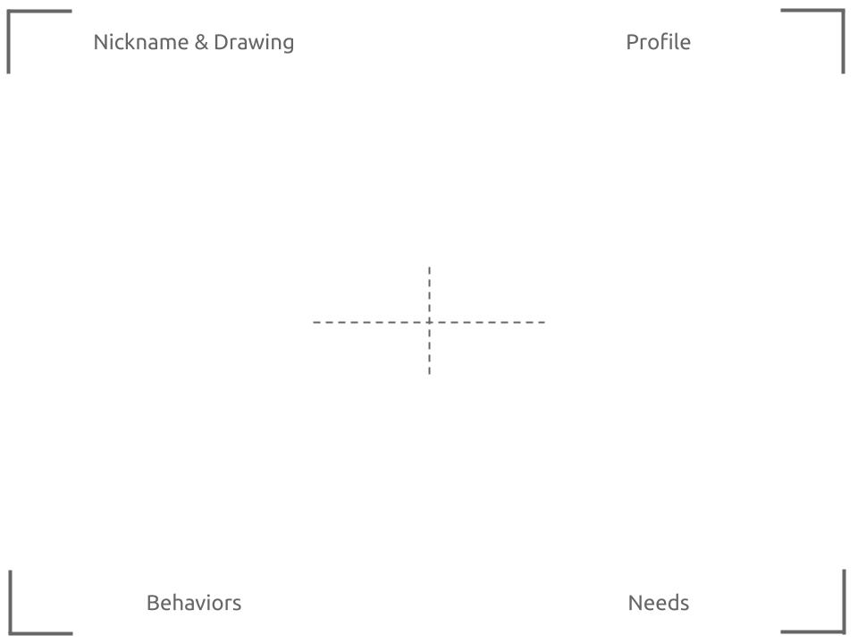

# Describe the Personas

A common way to represent users of our product is through [personas](https://www.stickyminds.com/article/how-pragmatic-personas-help-you-understand-your-end-user). 

Personas represent users in the system; their role and their needs. Our goal is to describe functionality from the point-of-view of the personas who will interact with the final product.

### Process

1. Divide the team into pairs or triplets and give each group the [Persona Template](https://drive.google.com/a/8thlight.com/file/d/1i2zDAoFPh_TjzPFF8uWASK0f0sRiT1_p/view?usp=drive_web)
2. Ask each group to create a persona
3. Each group represents their persona to the whole team
4. Redivide the team and repeat

It’s important to flesh out as many personas as necessary. Repeats can be coalesced and prioritized. By the end, we should have described the all of the personas for the various product users. Product owners should participate in this to help identify and review persona descriptions.



