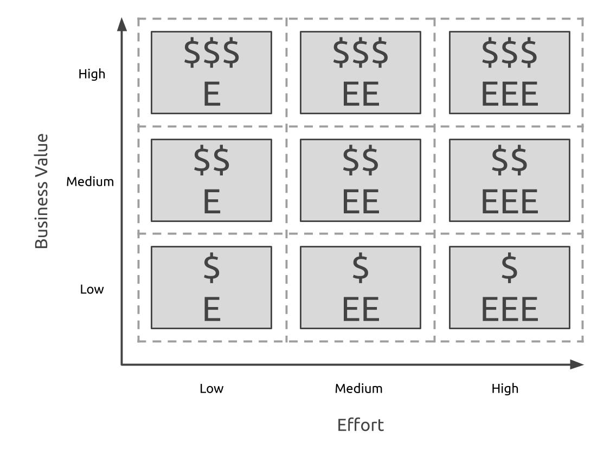
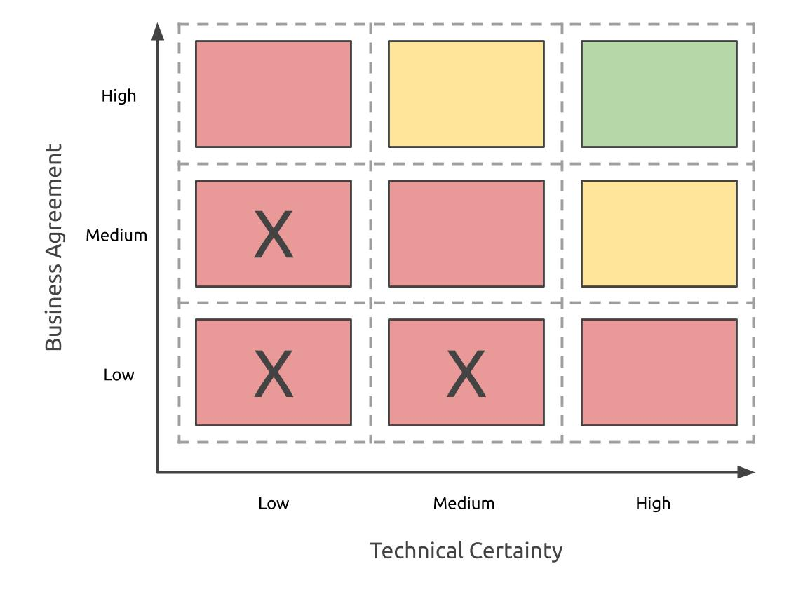
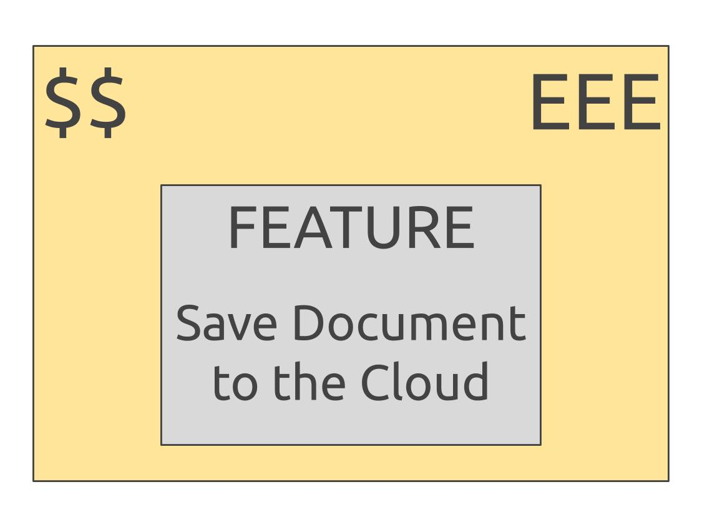

# Technical & Business Review

### Process

In order to better understand the features from the last exercise, we need to assess them in terms of effort, value, and uncertainty. In this exercise, we’ll annotate the feature canvas.

For effort and business value, we can annotate each feature using a scale of 1-3. 

Ranking uncertainty requires us to rate a feature for its technical uncertainty and business agreement.

Technical uncertainty is how well the development team understands how to implement a feature.

Business agreement is how well the business people agree on what goes into a feature.

We then combine these two ratings to come up with an overall level of uncertainty, red \(high\), yellow \(medium\), and green \(low\).

Those features in the lower left corner are marked with an “X”. Those features are not suitable for the MVP.

This feature has medium business value, high effort, and medium uncertainty.

During this exercise, important technical details are described, assumptions are defined, and uncertainties are described. **Many of these notes contain extra information that can be referenced throughout the development cycle and should be kept attached to the feature cards.**



