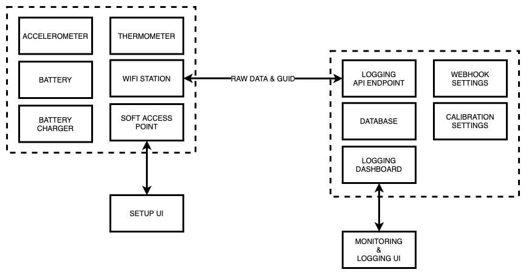

# Pilot

## Overview

Pilot is a digital hydrometer and thermometer that is placed inside a fermentation vessel during the fermentation of beer, wine, cider, mead, etc. It produces a continual log of gravity and temperature measurements without the need for human interaction or removal of a sample. By leveraging the principles of buoyancy, density, and gravity, measured and tracked with accelerometers, temperature sensors, and opensource software, it is not only possible to build such a device, but to make it accessible to tech-literate home brewers.

### How it Works

While traditional hydrometers sink vertically in order to measure the density of a liquid, Pilot both sinks and _tilts_ at a specific angle in proportion to the density of the fluid its submerged in. By using a digital accelerometer, the angle of tilt is measured to a high degree of accuracy, and therefore the change of gravity can be measured over time. Temperature is also logged to both monitor the temperature over time, as well as being factored into density calculations.

Encased and balanced in a water-tight housing, an ESP-01 module acts as the main microprocessor for Pilot. It's capabilities include reading sensor data from an I2C \(inter-integrated circuit\) bus, calling API \(application program interface\) endpoints via WIFI, hosting webpages as a soft access point, and consuming very little power by using a "deep sleep" mode. Along with the ESP-01, an I2C 3-axis accelerometer, I2C temperature senor, battery, and battery charger, make up the rest of the necessary hardware.

After construction, individual calibration is necessary for each device as they all have slightly different characteristics. This is done by using regression to find an equation that explains the correlation between measurements taken from a traditional hydrometer and the angle of Pilot in fluids of different densities. See [iSpindle Calibration Tool](http://www.ispindel.de/tools/calibration/calibration.htm). The calibration is stored on Pilot servers as "factory defaults" and is used to to adjust raw data received via the API. For ease of use, the data from Pilot is completely raw and therefore calibration adjustments can be made in the UI after its already in the hands of a home-brewer.

After calibration, in order for Pilot to log data, the ESP-01 must first be connected to the internet via WIFI. This is done via an HTML \(hypertext markup language\) firmware settings/setup dashboard hosted on the ESP-01 while in Soft Access Point mode. After connecting to the internet, the device can begin to send log data to the API. Along with the data, a GUID \(globally unique identification\) and other diagnostic data is sent. A user can log into Pilot servers by creating an account and registering the Pilot device's GUID, which attached to the hardware. This is the same GUID that will be sent along with all requests from the device.

After receiving data from the device, the Pilot API stores the data in a database, which is accessible via a the UI \(user interface\). This data is exportable in different formats and future versions will give the option of setting up a webhook to allow for users to build out their own infrastructure/monitoring tools.

