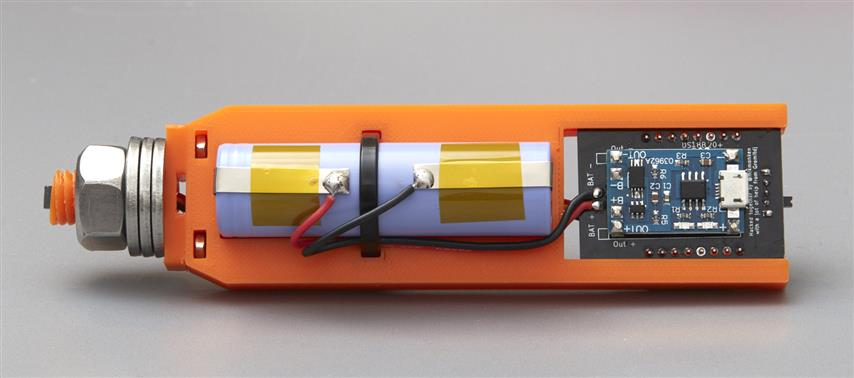

# Mechanical Properties & Design

## Buoyancy and Stability of Floating Bodies

As the density of must decreases during fermentation due to the consumption of sugar, we want a proportional amount of tilt to be experienced by the floating hydrometer. In order for this to happen, principles of _density_, _buoyancy_, _gravity_, and _stability_, all must work in concert.

As the must’s gravity lowers, the hydrometer sinks lower into the liquid and the angle of the device approaches vertical. This is because volume of liquid that must be displaced _increases_ as the density of that liquid _decre_a_ses_ in order for the hydrometer to stay afloat. The center of mass being towards the bottom of the device means that the center of buoyancy is also located towards the bottom, and this concentration of forces towards one end causes the device to tilt.

This _tilting_ is due to tiny incremental shifts that cause the center of buoyancy to reorient with respect to the center of mass. As this happens, the forces of gravity and buoyancy find equilibrium only after the device’s tilt angle shifts. Given that these two sole forces on device continually form a neutral equilibrium, and that the mass, center of mass, and density of the device are constant, we can deduce that the density of the liquid is the only factor that will cause the device’s angle to change. Combined with the temperature, we can then calculate the gravity.

## Calibration & Balance

In order for the hydrometer’s tilt to be sensitive to changes in density of the fluid, and in order for us to calculate gravity from the tilt angle, we must calibrate the hydrometer’s physical design. To do this, we should place the hydrometer in pure water at `20ºC` with `1.000 SG`, and use ballasts \(small weights like nuts or inert pellets\), to ensure the center of mass is concentrated towards the bottom, but also that the device will list at an angle \(`20º +/- 5º` [as recommended by the iSpindle documentation](https://github.com/universam1/iSpindel/blob/master/docs/FAQ-en.md)\). This is likely so that at \(or near\) the lowest gravity readings, the hydrometer will still float and tilt at a measurable angle. Once the device is physically balanced, we can then begin to calibrate the devices firmware to correlate the angle of heel to the gravity of the fluid. This is covered later.

## Physical Construction

The physical construction of the digital hydrometer must meet the following criteria:

* The electronic components must fit within the housing
* There is a water-tight housing around the electrical components
* It is able to withstand the wet, acidic, and alcoholic environment of home brewing
* It must be food safe and not release contaminants
* The battery and other electronic components must be accessible for recharging/servicing
* The the device should fit within the opening of different fermentation vessels
* The construction shall not interfere with wireless signals required for operation
* It should be able to be sanitized with home brewing sanitation chemicals
* It should continue to operate after reasonable drops, falls, and bumps

### Preform PET Bottle \(“Petling”\)

For all of these criteria, a readily available solution has been found and testing by the iSpindle community: a “petling” or preform PET bottle. A preform is an intermediate product that is subsequently blown into a polyethylene terephthalate \(PET\) container. Once heated in a mold the containers are blown into a variety of markets to create a variety of container shapes, sizes, thicknesses, colors, etc. They’re commonly used in the geocaching community as durable containers to hide small caches in, and therefore are available in geocaching marketplaces relatively cheaply. Common ones in geocache shops, \([Geocache One for example](https://www.geocacheone.com/en/p/pet-preform-cache-container-clear)\) are around `13cm` in length and have an outer diameter of `2.5cm` and cost `~$2.00 USD`. Most of them weight between `10g` and `50g` at their heaviest/largest.

[Polyethylene terephthalate](https://omnexus.specialchem.com/selection-guide/polyethylene-terephthalate-pet-plastic) is the most commonly recycled plastic. It can be approved as safe for contact with foods and beverages by the FDA, Health Canada, EFSA & other health agencies, has an excellent resistance to alcohols and diluted acids, and is known for its good gas \(oxygen, carbon dioxide\) and moisture barrier properties. Given that PET fermentation vessels are often used in home brewing, it is safe to say that petlings can be sanitized and will not release contaminants.

The caps of petlings are usually [high density polyethylene \(HDPE\)](https://omnexus.specialchem.com/selection-guide/polyethylene-plastic#HDPE), another plastic that can be approved as food safe. Although it has properties that should ensure its resistance to breaking down in a brewing environment, if ballasted correctly, the cap of the petling should have limited contact with the must.

### PET Centrifuge Tube

Similar to the petling, a plastic centrifuge tubes \(often used for medical lab testing\) are also readily available and are inexpensive, water-tight, come in a variety of sizes.

### Glass Test Tubes and Vials

An alternative to PET preforms could be glass vials and test tubes that include a [high density polypropylene](https://omnexus.specialchem.com/selection-guide/polyethylene-plastic#HDPE) cap with a foam or rubber gasket. These have all of the advantages of the PET bottles, with added scratch resistance and avoidance of plastic pollution. Disadvantages include being more fragile, more expensive, and heavier.

Without testing, it’s difficult to know for sure if a glass alternative to petlings would be suitable, although I have a general aversion to plastics.

## Housing for Electronics


_TODO: Once a bill of materials has been finalized I can design an appropriate housing._


### iSpindle

The iSpindle community has developed several versions of a 3D-printable "[drawer](https://github.com/universam1/iSpindel/tree/master/drawer)," to hold and balance the various electronics and ballasts. I wish to take a similar approach.

### Tilt

The Tilt seems to employ a plastic mechanism for housing the electronics, offset from center, in order to cause the device to tilt while floating.

