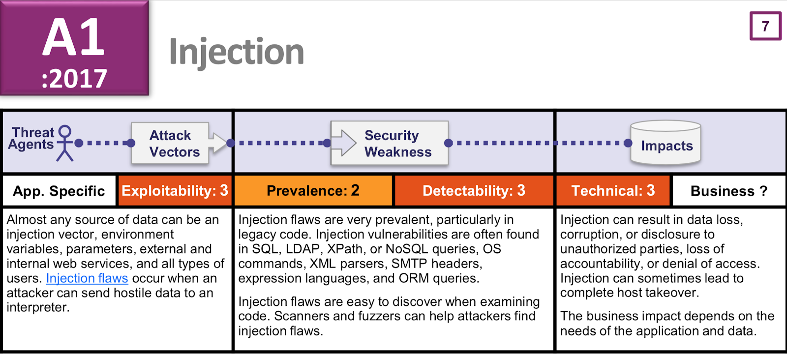
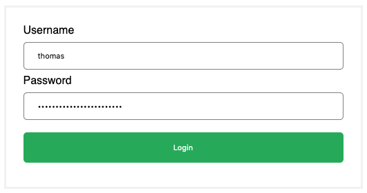

# SQL Injection



> ### SQL Injection flaws are introduced when software developers create dynamic database queries that include user supplied input.
>
> —[OWASP SQL Injection Prevention Cheat Sheet](https://cheatsheetseries.owasp.org/cheatsheets/SQL_Injection_Prevention_Cheat_Sheet.html)

## Login Form Example

Let's take a login form with that requires a user enter a username and password to log in.



In the happy-path case, a user enters in their details, presses "Login," and a request is sent to a server where we take what the user enters, search the database for that user, and then log that user into our web application.

```ruby
# SQL Injection Vulnerable Pseudocode
# -- snip --

let user = ORM.query(
  "SELECT * 
    FROM users 
    WHERE username = '#{params['username']}'
    AND password = '#{params['password']}'"
).execute()[0];

# -- snip -- 
#log_in_user(user)
```



```sql
CREATE TABLE users(
   id INT PRIMARY KEY         NOT NULL,
   username        VARCHAR    NOT NULL,
   password        VARCHAR    NOT NULL
);

INSERT INTO users (id, username, password) 
VALUES (1, 'sarah', 'good-password');

INSERT INTO users (id, username, password) 
VALUES (2, 'thomas', 'password123');

INSERT INTO users (id, username, password) 
VALUES (3, 'patrice', md5('palm-kumquat-futon-padden'));

```



```sql
SELECT * 
FROM users 
WHERE username='thomas' 
AND password='password123'
```



## Resources

* [https://github.com/OWASP/railsgoat/wiki/R5-A1-SQL-Injection-Concatentation](https://github.com/OWASP/railsgoat/wiki/R5-A1-SQL-Injection-Concatentation)
* [https://cheatsheetseries.owasp.org/cheatsheets/SQL\_Injection\_Prevention\_Cheat\_Sheet.html](https://cheatsheetseries.owasp.org/cheatsheets/SQL_Injection_Prevention_Cheat_Sheet.html)
* [https://www.websec.ca/kb/sql\_injection](https://www.websec.ca/kb/sql_injection)

